# Cogentra

## Enterprise Intelligence Platform

Cogentra is a backend engineering project built as the foundation for an AI-powered conversational intelligence platform.

The project started as a simple FastAPI application using in-memory objects. It is now being migrated toward a production-oriented architecture with:

- FastAPI
- Pydantic
- SQLAlchemy
- SQLite
- Dependency Injection
- Service Layer
- Repository Pattern
- Centralized Exception Handling

The current work is focused on completing the migration from the original in-memory architecture to a database-backed layered architecture.

---

# 1. Project Purpose

Cogentra is being built in stages.

The first stage is not about adding AI features immediately. The priority is to build a backend foundation that is:

- Persistent
- Maintainable
- Testable
- Clearly structured
- Easy to extend
- Close to production backend engineering practices

Once this foundation is stable, authentication and AI capabilities can be built on top of it without having to redesign the entire backend.

---

# 2. Architecture at a Glance

The target architecture is:

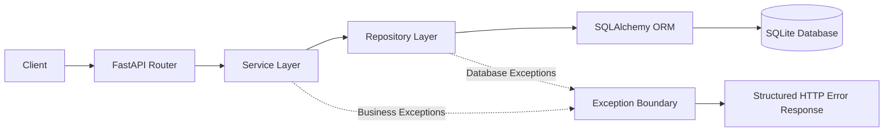

### In simple terms

```text
Client
  |
  v
Router
  |
  | "What API operation was requested?"
  v
Service
  |
  | "What should the application do?"
  v
Repository
  |
  | "How do I persist/retrieve the data?"
  v
Database
```

This separation is the central architectural goal of the project.

---

# 3. Technology Stack

| Technology | Role |
|---|---|
| Python | Backend language |
| FastAPI | REST API framework |
| Pydantic | Request/response validation |
| SQLAlchemy | ORM and database access |
| SQLite | Current database |
| Uvicorn | ASGI application server |
| Git | Version control |

---

# 4. Core Domain

Cogentra currently revolves around four main entities:

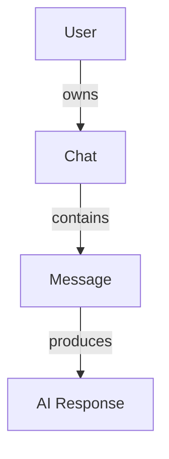

The relationship can be understood as:

```text
User
 |
 +-- Chat
      |
      +-- Message
           |
           +-- AI Response
```

The project is intentionally separating these domains instead of putting all operations into one large service.

---

# 5. How the Project Started

## In-Memory Persistence

The original implementation stored application state directly in Python objects.

The conceptual flow was:

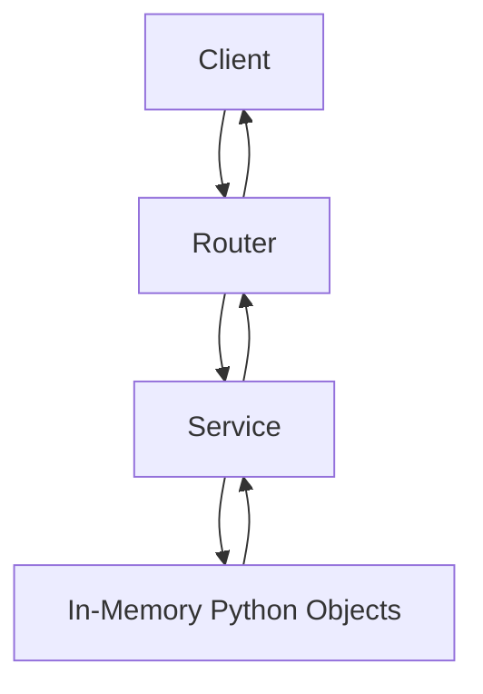

For example, the application conceptually maintained:

```text
User
 |
 +-- Chat
 |    |
 |    +-- Message
 |    +-- Message
 |
 +-- Chat
      |
      +-- Message
      +-- Message
```

The service layer directly manipulated these objects.

### Why this was useful initially

The in-memory architecture made it possible to build and understand the application quickly.

It allowed the project to establish:

- API routes
- Models
- CRUD behavior
- Service logic
- Request/response schemas
- Initial domain relationships

However, it was a prototype architecture rather than a durable backend architecture.

### Problems with in-memory persistence

| Problem | Result |
|---|---|
| Process memory only | Data disappears after restart |
| No durable storage | Application state is not persistent |
| Object graph as storage | Business logic becomes coupled to persistence |
| No database constraints | Uniqueness and relationships are not enforced by a database |
| Difficult to scale | Multiple application instances cannot share the same state |

This led to the database migration.

---

# 6. Migration to Database Persistence

The migration changed the persistence model from:

```text
Service
   |
   v
Python Objects
```

to:

```text
Service
   |
   v
Repository
   |
   v
SQLAlchemy
   |
   v
Database
```

The complete migration is:

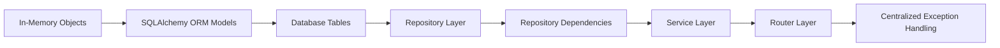

The important change was not simply replacing Python lists/objects with SQLite.

The project was reorganized so that persistence became its own responsibility.

---

# 7. Database-Backed Architecture

The current persistence flow is:

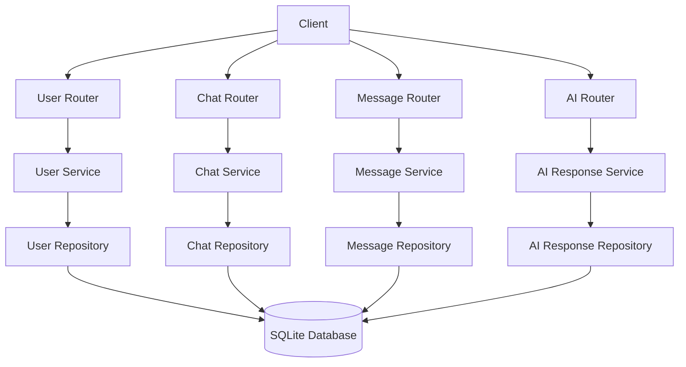

This gives each domain a clear path through the application.

---

# 8. Why Repositories Were Introduced

Before the migration, services were responsible for manipulating in-memory state.

After the migration, services should not need to know how the database works.

For example:

```text
UserService
    |
    | create user
    v
UserRepository
    |
    | INSERT
    v
Database
```

The service knows:

> A user needs to be created.

The repository knows:

> How that user is persisted.

This distinction keeps business logic independent from SQLAlchemy implementation details.

---

# 9. Why Services Were Separated

The project also moved toward domain-specific services.

Current responsibility:

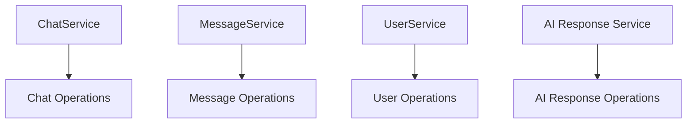

A major migration was moving message operations out of `ChatService`.

### Before

```text
ChatService
 |
 +-- create chat
 +-- delete chat
 +-- rename chat
 +-- add message
 +-- edit message
 +-- delete message
```

### After

```text
ChatService
 |
 +-- create chat
 +-- delete chat
 +-- rename chat


MessageService
 |
 +-- add message
 +-- edit message
 +-- delete message
```

This makes the service boundaries easier to understand and maintain.

---

# 10. Dependency Injection

Dependencies construct the database session, repositories, and services.

The dependency flow is:

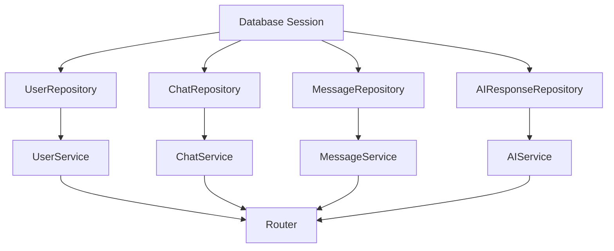

This prevents routers from manually creating their dependencies.

Instead, the router requests the required service and FastAPI resolves the dependency graph.

---

# 11. Exception Handling

The project separates database errors from application-level errors.

## Repository transaction handling

Repository write operations now follow:

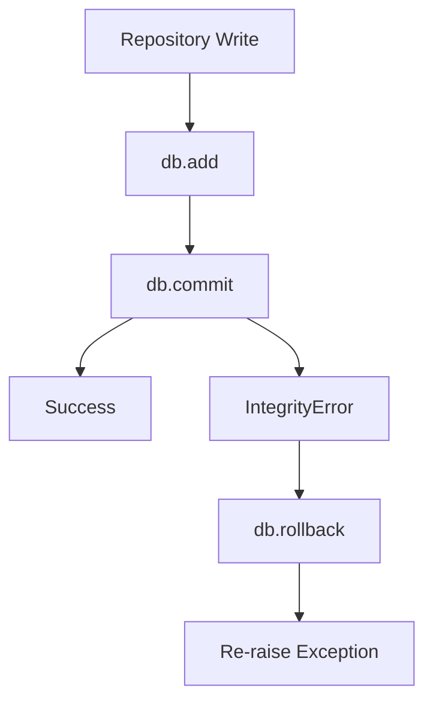

The important rule is:

> A failed database transaction must not be silently reported as a successful operation.

The repository therefore:

1. Attempts the transaction.
2. Rolls back when an integrity failure occurs.
3. Re-raises the exception.
4. Allows the higher application layer to decide how the failure should be represented.

---

## Application exceptions

The project has domain-level exceptions such as:

| Exception | Meaning |
|---|---|
| `UserNotFoundError` | Requested user does not exist |
| `ChatNotFoundError` | Requested chat does not exist |
| `MessageNotFoundError` | Requested message does not exist |
| `AIResponseNotFoundError` | Requested AI response does not exist |
| `DuplicateEmailError` | Email conflicts with an existing user |
| `DuplicateChatError` | Chat conflicts with the duplicate-chat rule |
| `NoEmailChangeError` | New email is the same as the current email |
| `ChatRenameError` | New title is the same as the current title |

These exceptions describe application meaning rather than exposing database implementation details.

---

# 12. HTTP Exception Boundary

Application exceptions are converted into structured HTTP responses centrally.

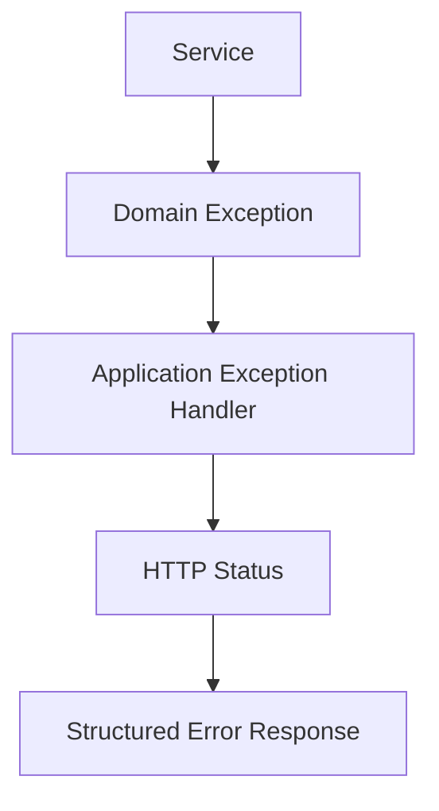

Current mapping includes:

```text
UserNotFoundError
        |
        v
404 Not Found


ChatNotFoundError
        |
        v
404 Not Found


MessageNotFoundError
        |
        v
404 Not Found


AIResponseNotFoundError
        |
        v
404 Not Found


DuplicateEmailError
        |
        v
409 Conflict


DuplicateChatError
        |
        v
409 Conflict


NoEmailChangeError
        |
        v
400 Bad Request


ChatRenameError
        |
        v
400 Bad Request
```

Unexpected errors have a global fallback rather than exposing raw internal exceptions to the API client.

---

# 13. Example Request Flow

A successful user creation request now follows:

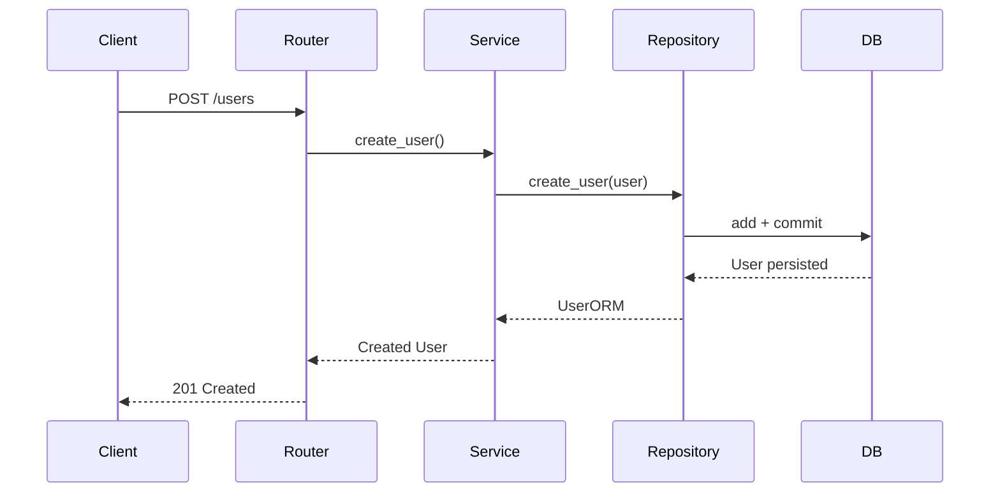

A database failure follows:

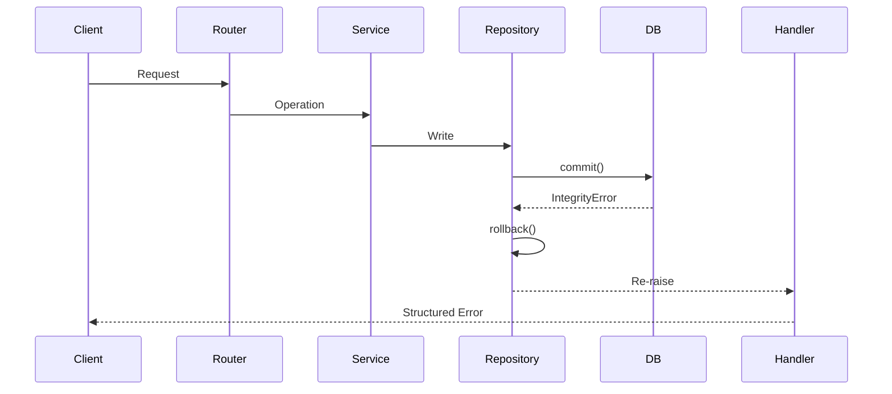

---

# 14. Current Project Structure

The intended structure is:

```text
Cogentra/
|
+-- routers/
|   +-- user_router
|   +-- chat_router
|   +-- message_router
|   +-- ai_router
|   +-- admin_router
|   +-- health_router
|   +-- debug_router
|
+-- services/
|   +-- user_service
|   +-- chat_service
|   +-- message_service
|   +-- ai_response_service
|
+-- repositories/
|   +-- user_repository
|   +-- chat_repository
|   +-- message_repository
|   +-- ai_response_repository
|
+-- database/
|   +-- database configuration
|
+-- models/
|   +-- SQLAlchemy ORM models
|
+-- schemas/
|   +-- request schemas
|   +-- response schemas
|
+-- dependencies/
|   +-- database/session dependencies
|   +-- repository dependencies
|   +-- service dependencies
|   +-- entity dependencies
|
+-- exceptions/
|   +-- domain exceptions
|
+-- main.py
```

The exact file organization may continue to evolve while the migration is completed.

---

# 15. Current Migration Status

## Migration Flow

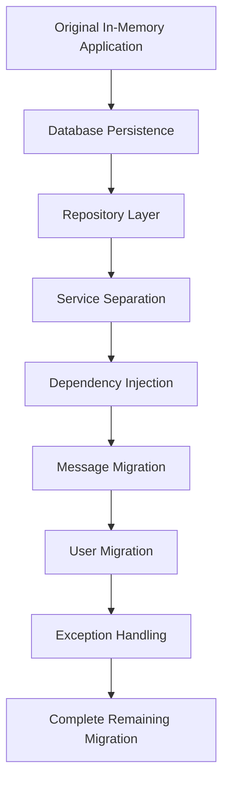

## Current Position


Legend:

```text
Green  = Completed
Yellow = Currently being finalized
Grey   = Remaining
```

---

# 16. Detailed Progress

| Component | Status | Details |
|---|---|---|
| In-memory persistence | Complete | Replaced as the primary persistence approach |
| SQLAlchemy ORM | Complete | Core entities use ORM models |
| SQLite persistence | Complete | Database-backed storage is active |
| Repository pattern | Complete | User, Chat, Message, and AI response repositories exist |
| Dependency injection | Complete | Database, repository, service, and entity dependencies are wired |
| Message migration | Complete | Message operations moved from ChatService to MessageService |
| User migration | Complete | User Router → UserService → UserRepository flow is implemented and tested |
| Repository exception handling | Complete | Integrity failures rollback and re-raise |
| Domain exceptions | Complete | Current domain exceptions are defined |
| HTTP exception handlers | Complete | Domain exceptions are registered centrally |
| Chat migration | In Progress | Remaining chat behavior is being finalized |
| AI response migration | In Progress | Remaining AI response architecture is being finalized |
| Legacy `CurrentUser` / `get_curr_user` removal | In Progress | Old in-memory dependency architecture is being removed |
| Database-to-domain exception translation | Pending | Business-specific translation of raw database failures remains |
| Full migration verification | Pending | Complete endpoint and failure-path verification remains |

---

# 17. What Has Already Changed

The migration has produced several important architectural changes.

### Persistence

```text
Before:
Python Objects

After:
SQLAlchemy ORM
      |
      v
SQLite
```

### Message ownership

```text
Before:
ChatService
    |
    +-- Messages

After:
MessageService
    |
    +-- Messages
```

### User flow

```text
Before:
Router
   |
   v
In-Memory User

After:
UserRouter
   |
   v
UserService
   |
   v
UserRepository
   |
   v
Database
```

### Database failure handling

```text
Before:
Database failure
      |
      v
Uncontrolled error

After:
Database failure
      |
      v
rollback()
      |
      v
re-raise
      |
      v
Application exception boundary
```

---

# 18. Current Development Focus

The immediate objective is to finish the migration rather than introduce new functionality.

The remaining work is focused on:

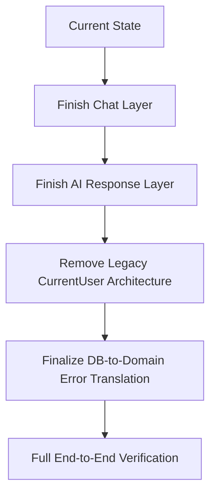

The project will move to the next major capability only after this migration is stable.

---

# 19. Current Status

Cogentra is currently transitioning from a prototype backend into a structured, database-backed backend.

The major foundation is already in place:

```text
FastAPI
   |
   v
Routers
   |
   v
Services
   |
   v
Repositories
   |
   v
SQLAlchemy
   |
   v
SQLite
```

The remaining migration work is being completed domain by domain.

The immediate goal is:

> Complete the migration, remove the remaining legacy architecture, verify the complete request and error flows, and leave a clean production-oriented backend foundation.
